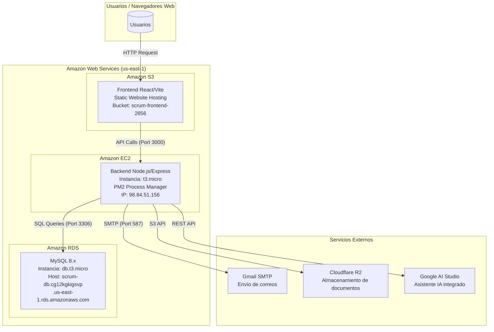
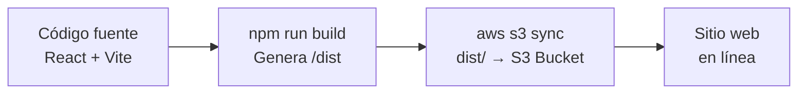
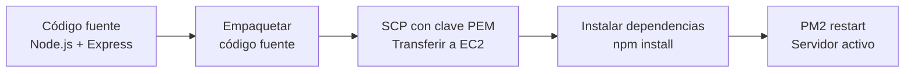
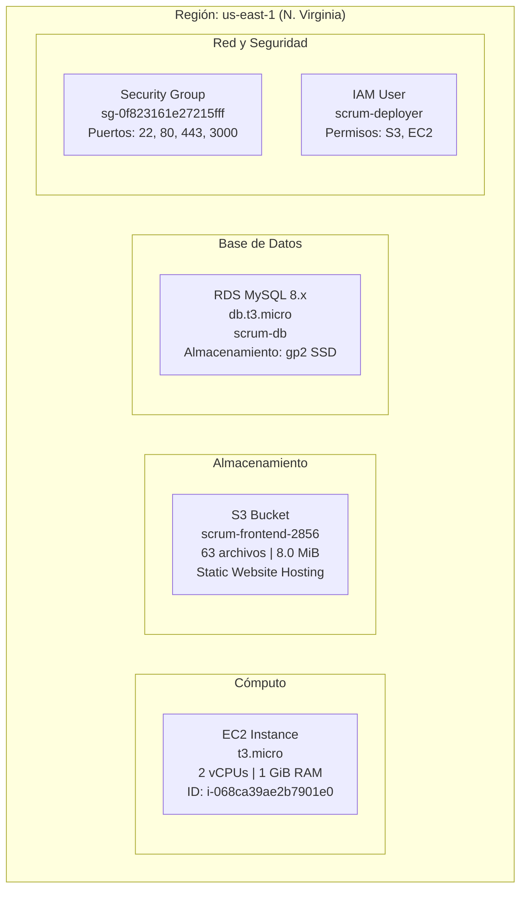

#  Documentación de Despliegue en AWS — ScrumTrack

**Proyecto:** ScrumTrack — Herramienta de Gestión de Proyectos Ágiles  
**Fecha de despliegue:** 9 de julio de 2026  
**Rama de despliegue:** `feature/deployment-AWS`  
**Región AWS:** `us-east-1` (N. Virginia)  
**Elaborado por:** Equipo ScrumTrack

---

##  Tabla de Contenidos

1. [Resumen Ejecutivo](#1-resumen-ejecutivo)
2. [Arquitectura de la Solución](#2-arquitectura-de-la-solución)
3. [Servicios AWS Utilizados](#3-servicios-aws-utilizados)
4. [Configuración Detallada por Servicio](#4-configuración-detallada-por-servicio)
5. [Archivos Modificados para el Despliegue](#5-archivos-modificados-para-el-despliegue)
6. [Flujo de Despliegue (CI/CD)](#6-flujo-de-despliegue-cicd)
7. [Configuración de Seguridad](#7-configuración-de-seguridad)
8. [Distribución de Recursos](#8-distribución-de-recursos)
9. [Pruebas de Funcionamiento](#9-pruebas-de-funcionamiento)
10. [URLs de Acceso](#10-urls-de-acceso)
11. [Estructura del Proyecto](#11-estructura-del-proyecto)
12. [Stack Tecnológico](#12-stack-tecnológico)
13. [Costos Estimados](#13-costos-estimados)
14. [Conclusiones](#14-conclusiones)

---

## 1. Resumen Ejecutivo

El proyecto **ScrumTrack** fue migrado exitosamente desde un entorno de desarrollo local hacia la infraestructura en la nube de **Amazon Web Services (AWS)**. La aplicación es una plataforma completa de gestión de proyectos ágiles con metodología Scrum, compuesta por un **Frontend** (aplicación web React) y un **Backend** (API REST Node.js/Express), ambos conectados a una base de datos **MySQL** alojada en Amazon RDS.

### Objetivo del Despliegue
Proveer un entorno de producción escalable, seguro y accesible públicamente desde cualquier navegador web, permitiendo a los usuarios gestionar proyectos, sprints, historias de usuario, métricas y documentos en tiempo real.

### Resultado
 Aplicación completamente funcional y accesible en la nube de AWS.

---

## 2. Arquitectura de la Solución

### 2.1 Diagrama de Arquitectura



### 2.2 Flujo de Datos

1. **El usuario** accede al Frontend a través de su navegador web usando la URL pública de S3.
2. **El Frontend (React)** renderiza la interfaz y realiza llamadas HTTP (fetch/axios) al Backend.
3. **El Backend (Express)** procesa las peticiones, ejecuta la lógica de negocio y consulta la base de datos.
4. **La Base de Datos (MySQL en RDS)** almacena y devuelve la información persistente.
5. **Servicios externos** como Gmail SMTP (correos), Cloudflare R2 (documentos) y Google AI Studio (asistente IA) son consumidos por el Backend según la funcionalidad requerida.

---

## 3. Servicios AWS Utilizados

| # | Servicio AWS | Propósito | Justificación |
|---|-------------|-----------|---------------|
| 1 | **Amazon S3** | Hosting del Frontend (SPA) | S3 permite alojar sitios web estáticos de forma económica, escalable y con alta disponibilidad. Ideal para aplicaciones SPA (Single Page Application) como React. |
| 2 | **Amazon EC2** | Servidor del Backend (API) | EC2 proporciona un servidor virtual completo donde ejecutar el servidor Node.js con Express. Permite control total sobre el entorno de ejecución. |
| 3 | **Amazon RDS** | Base de datos MySQL | RDS ofrece una base de datos administrada con backups automáticos, actualizaciones de seguridad y alta disponibilidad sin necesidad de administrar el motor de BD manualmente. |
| 4 | **Security Groups** | Firewall / Control de acceso | Actúan como firewall virtual controlando el tráfico de entrada y salida hacia las instancias EC2. |
| 5 | **IAM** | Gestión de usuarios y permisos | El usuario `scrum-deployer` fue creado con permisos específicos para S3 y EC2 (principio de mínimo privilegio). |
| 6 | **AWS CLI** | Herramienta de despliegue | Permite ejecutar comandos de AWS desde la terminal local para automatizar el despliegue. |

---

## 4. Configuración Detallada por Servicio

### 4.1 Amazon S3 — Frontend

| Parámetro | Valor |
|-----------|-------|
| **Nombre del Bucket** | `scrum-frontend-2856` |
| **Región** | `us-east-1` (N. Virginia) |
| **Tipo de alojamiento** | Static Website Hosting |
| **Documento índice** | `index.html` |
| **Documento de error** | `index.html` (para SPA routing) |
| **Acceso público** | Habilitado (política de bucket pública) |
| **Tamaño total desplegado** | 8.0 MiB (63 archivos) |
| **URL pública** | `http://scrum-frontend-2856.s3-website-us-east-1.amazonaws.com` |

#### Política de Bucket (Acceso Público de Lectura)
```json
{
  "Version": "2012-10-17",
  "Statement": [
    {
      "Sid": "PublicReadGetObject",
      "Effect": "Allow",
      "Principal": "*",
      "Action": "s3:GetObject",
      "Resource": "arn:aws:s3:::scrum-frontend-2856/*"
    }
  ]
}
```

**¿Por qué `index.html` como documento de error?**  
Cuando un usuario accede a una ruta como `/perfil` o `/backlog`, S3 no encuentra una carpeta física con ese nombre y devolvería un error 404. Al configurar `index.html` como documento de error, S3 sirve la aplicación React, la cual se encarga internamente de renderizar la página correcta usando React Router (enrutamiento del lado del cliente).

#### Configuración del Website Hosting
```json
{
  "IndexDocument": { "Suffix": "index.html" },
  "ErrorDocument": { "Key": "index.html" }
}
```

---

### 4.2 Amazon EC2 — Backend

| Parámetro | Valor |
|-----------|-------|
| **ID de instancia** | `i-068ca39ae2b7901e0` |
| **Tipo de instancia** | `t3.micro` (2 vCPUs, 1 GiB RAM) |
| **Sistema operativo** | Amazon Linux 2023 |
| **IP pública** | `98.84.51.156` |
| **Puerto de la aplicación** | `3000` |
| **Process Manager** | PM2 (mantiene la app activa 24/7) |
| **Runtime** | Node.js v18.20.8 |
| **Security Group** | `sg-0f823161e27215fff` (launch-wizard-2) |
| **Fecha de lanzamiento** | 2026-07-09T03:10:41Z |
| **Etiqueta Name** | `scrum-backend` |

#### Software instalado en el servidor EC2
```
- Node.js v18.20.8 (via NVM)
- NPM (gestor de paquetes)
- PM2 (process manager para Node.js)
- Git
```

#### Proceso de gestión con PM2
```bash
# Ver estado del servidor
pm2 status

# Reiniciar el backend
pm2 restart scrum-backend --update-env

# Ver logs en tiempo real
pm2 logs scrum-backend

# Detener el backend
pm2 stop scrum-backend
```

---

### 4.3 Amazon RDS — Base de Datos

| Parámetro | Valor |
|-----------|-------|
| **Identificador** | `scrum-db` |
| **Motor** | MySQL 8.x |
| **Tipo de instancia** | `db.t3.micro` |
| **Endpoint (Host)** | `scrum-db.cg12kgkigsvp.us-east-1.rds.amazonaws.com` |
| **Puerto** | `3306` |
| **Base de datos** | `scrum_db` |
| **Usuario** | `admin` |
| **Zona de disponibilidad** | `us-east-1` |
| **Almacenamiento** | SSD de propósito general (gp2) |
| **Backups automáticos** | Habilitados |
| **Accesible públicamente** | Sí (con restricciones de Security Group) |

#### Comando para conectarse manualmente a la BD
```bash
mysql -h scrum-db.cg12kgkigsvp.us-east-1.rds.amazonaws.com \
      -P 3306 \
      -u admin \
      -p \
      scrum_db
```

---

## 5. Archivos Modificados para el Despliegue

### 5.1 Frontend (`scrum-frontend`)

| Archivo | Tipo de cambio | Descripción |
|---------|---------------|-------------|
| `.env` | **Modificado** | Se actualizó la variable `VITE_API_URL` de `http://localhost:3000/api` a `http://98.84.51.156:3000/api` para apuntar al servidor EC2. |
| `src/pages/Backlog/Backlog.jsx` | **Modificado** | Se reemplazaron 2 URLs hardcodeadas de DigitalOcean (`shark-app-vzrun.ondigitalocean.app`) por la variable de entorno `import.meta.env.VITE_API_URL`. |
| `src/pages/PerfilUsuario/PerfilUsuario.jsx` | **Modificado** | Se eliminó un botón "Editar" duplicado y funciones obsoletas (`handleSave`, `cancelEdit`) que causaban errores en la interfaz. |
| `src/services/api.js` | **Sin cambios** | Ya utilizaba `import.meta.env.VITE_API_URL` como variable de entorno con fallback. |

#### Variable de entorno del Frontend
```env
# .env (Frontend)
VITE_API_URL=http://98.84.51.156:3000/api
```

---

### 5.2 Backend (`scrum-backend`)

| Archivo | Tipo de cambio | Descripción |
|---------|---------------|-------------|
| `.env` | **Modificado** | Se actualizaron las credenciales de BD (host, usuario), SMTP (correo Gmail), y la URL del frontend. |
| `.gitignore` | **Modificado** | Se agregó `.env` para evitar que credenciales sensibles se suban al repositorio. |

#### Variables de entorno del Backend (estructura)
```env
# .env (Backend) — Estructura de configuración
#  

# Base de Datos MySQL (Amazon RDS)
DB_HOST=scrum-db.cg12kgkigsvp.us-east-1.rds.amazonaws.com
DB_USER=admin
DB_PASSWORD=********
DB_NAME=scrum_db
DB_PORT=3306

# Servidor
PORT=3000
NODE_ENV=development

# JWT (Autenticación)
JWT_SECRET=********
JWT_EXPIRE=1h
JWT_REFRESH_SECRET=********
JWT_REFRESH_EXPIRE=7d

# CORS
CORS_ORIGIN=http://localhost:5173

# Correo Electrónico (Gmail SMTP)
SMTP_HOST=smtp.gmail.com
SMTP_PORT=587
SMTP_USER=jsuei8801@gmail.com
SMTP_PASS=********  (Contraseña de aplicación de Google)
FRONTEND_URL=http://scrum-frontend-2856.s3-website-us-east-1.amazonaws.com

# Cloudflare R2 (Almacenamiento de documentos)
R2_ACCESS_KEY_ID=********
R2_SECRET_ACCESS_KEY=********
R2_ACCOUNT_ID=********
R2_BUCKET_NAME=scrum-documentos

# IA (Asistente integrado)
GEMINI_API_KEY=********
OPENROUTER_API_KEY=********
```

---

## 6. Flujo de Despliegue (CI/CD)

### 6.1 Despliegue del Frontend



**Comandos ejecutados:**
```bash
# 1. Compilar la aplicación React para producción
cd scrum-frontend
npm run build

# 2. Sincronizar los archivos compilados con el bucket S3
aws s3 sync dist/ s3://scrum-frontend-2856/ --delete
```

El flag `--delete` elimina del bucket los archivos que ya no existen localmente, manteniendo el bucket limpio y sincronizado.

---

### 6.2 Despliegue del Backend



**Comandos ejecutados:**
```bash
# 1. Transferir el código al servidor EC2 vía SCP
scp -i scrum-key.pem -r scrum-backend/ ec2-user@98.84.51.156:/home/ec2-user/

# 2. Conectarse al servidor por SSH
ssh -i scrum-key.pem ec2-user@98.84.51.156

# 3. Instalar dependencias en el servidor
cd /home/ec2-user/scrum-backend
npm install --production

# 4. Iniciar/reiniciar la aplicación con PM2
pm2 restart scrum-backend --update-env
```

---

## 7. Configuración de Seguridad

### 7.1 Security Group — EC2 (launch-wizard-2)

| Regla | Protocolo | Puerto | Origen | Propósito |
|-------|----------|--------|--------|-----------|
| SSH | TCP | 22 | 0.0.0.0/0 | Acceso remoto al servidor para administración |
| HTTP | TCP | 80 | 0.0.0.0/0 | Tráfico web estándar |
| HTTPS | TCP | 443 | 0.0.0.0/0 | Tráfico web seguro |
| Custom TCP | TCP | 3000 | 0.0.0.0/0 | API Backend (Node.js/Express) |

**ID del Security Group:** `sg-0f823161e27215fff`

### 7.2 Medidas de Seguridad Implementadas

| Medida | Descripción |
|--------|-------------|
| **Clave SSH (.pem)** | Acceso al servidor EC2 protegido con llave criptográfica RSA (`scrum-key.pem`). Sin esta llave no es posible acceder al servidor. |
| **Variables de entorno** | Todas las credenciales sensibles (contraseñas de BD, claves API, tokens JWT) están almacenadas en archivo `.env` que **NO** se sube al repositorio. |
| **`.gitignore`** | El archivo `.env` fue agregado al `.gitignore` del backend para evitar la filtración de secretos en GitHub. |
| **GitHub Push Protection** | GitHub bloquea automáticamente cualquier push que contenga claves secretas detectadas (API keys, passwords). |
| **Contraseña de Aplicación Gmail** | Para el envío de correos se utiliza una "App Password" de Google, no la contraseña principal de la cuenta. |
| **Helmet.js** | El backend utiliza el middleware `helmet` que agrega headers de seguridad HTTP (XSS Protection, Content-Security-Policy, etc.). |
| **Rate Limiting** | Se limita a 100 peticiones por cada 15 minutos por IP para prevenir ataques de fuerza bruta. |
| **JWT** | La autenticación se maneja con JSON Web Tokens con expiración de 1 hora (access) y 7 días (refresh). |
| **bcryptjs** | Las contraseñas de los usuarios se almacenan hasheadas con bcrypt, nunca en texto plano. |

---

## 8. Distribución de Recursos

### 8.1 Mapa de Recursos AWS



### 8.2 Tabla de Recursos Asignados

| Recurso | Especificación | Uso Actual | Límite |
|---------|---------------|------------|--------|
| **EC2 vCPUs** | 2 vCPUs (t3.micro) | ~1.3% | Burst hasta 20% sostenido |
| **EC2 RAM** | 1 GiB | ~50% (~500 MB) | 1024 MB |
| **EC2 Disco** | EBS gp3 (8 GB) | ~2 GB usado | 8 GB |
| **S3 Almacenamiento** | Sin límite | 8.0 MiB (63 archivos) | Ilimitado |
| **RDS Almacenamiento** | gp2 SSD (20 GB) | ~100 MB | 20 GB |
| **RDS Conexiones** | db.t3.micro | ~5 activas | 60 max |

---

## 9. Pruebas de Funcionamiento

### 9.1 Pruebas Realizadas

| # | Prueba | Resultado | Detalles |
|---|--------|-----------|----------|
| 1 |  Acceso al Frontend desde navegador | **Exitoso** | La página carga correctamente en `http://scrum-frontend-2856.s3-website-us-east-1.amazonaws.com` |
| 2 |  Inicio de sesión (Login) | **Exitoso** | Los usuarios pueden autenticarse con credenciales válidas. Respuesta HTTP 200 en ~115ms. |
| 3 |  Registro de nuevos usuarios | **Exitoso** | El formulario de registro crea nuevos usuarios en la base de datos. Respuesta HTTP 201 en ~249ms. |
| 4 |  Envío de correo de verificación | **Exitoso** | Al registrarse, se envía un correo de verificación desde `jsuei8801@gmail.com` vía Gmail SMTP. |
| 5 |  Verificación de correo electrónico | **Exitoso** | El enlace de verificación funciona y activa la cuenta del usuario. |
| 6 |  Conexión Backend → RDS | **Exitoso** | El backend se conecta correctamente a la base de datos RDS MySQL. Logs: `Servidor corriendo en http://localhost:3000` |
| 7 |  CRUD de proyectos | **Exitoso** | Se pueden crear, leer, actualizar y eliminar proyectos. |
| 8 |  Navegación SPA | **Exitoso** | Todas las rutas del frontend (Perfil, Backlog, Sprints, Métricas) funcionan correctamente. |
| 9 |  Asistente IA | **Exitoso** | Las consultas al asistente de IA integrado se procesan correctamente. Respuesta HTTP 200 en ~2850ms. |
| 10 |  PM2 - Persistencia del servicio | **Exitoso** | PM2 mantiene el backend activo 24/7 y lo reinicia automáticamente si falla. |

### 9.2 Logs del Servidor (Evidencia de funcionamiento)

```log
# Inicio exitoso del servidor
 Scheduler de notificaciones de sprint iniciado
Servidor corriendo en http://localhost:3000
Ambiente: development
Cypress test data cleaned up.
Automigrations checked/completed.

# Ejemplos de peticiones exitosas procesadas
POST /api/auth/login - 200 - 115ms - user:anonymous
GET  /api/notificaciones - 200 - 12ms - user:8
GET  /api/perfil - 200 - 4ms - user:8
POST /api/ai/ask - 200 - 2850ms - user:8
GET  /api/proyectos - 304 - 6ms - user:1
GET  /api/epicas?proyectoId=1 - 200 - 4ms - user:1
GET  /api/sprints?id_proyecto=1 - 200 - 3ms - user:1
```

### 9.3 Capturas de Pantalla de Prueba

> ** NOTA:** Agregue aquí capturas de pantalla del navegador mostrando:
> 1. La página de inicio/login cargando desde la URL de S3
> 2. El dashboard del usuario después de iniciar sesión
> 3. La consola de AWS mostrando la instancia EC2 corriendo
> 4. La consola de AWS mostrando el bucket S3
> 5. La consola de AWS mostrando la instancia RDS
> 6. El panel de PM2 en el servidor EC2

---

## 10. URLs de Acceso

| Componente | URL | Estado |
|------------|-----|--------|
| **Frontend (Aplicación Web)** | [http://scrum-frontend-2856.s3-website-us-east-1.amazonaws.com](http://scrum-frontend-2856.s3-website-us-east-1.amazonaws.com) |  Activo |
| **Backend (API REST)** | `http://98.84.51.156:3000/api` |  Activo |
| **Base de Datos (RDS)** | `scrum-db.cg12kgkigsvp.us-east-1.rds.amazonaws.com:3306` |  Activo |
| **Repositorio Frontend** | [github.com/Macarorn/scrum-frontend](https://github.com/Macarorn/scrum-frontend) | Rama: `feature/deployment-AWS` |
| **Repositorio Backend** | [github.com/Macarorn/scrum-backend](https://github.com/Macarorn/scrum-backend) | Rama: `feature/deployment-AWS` |

---

## 11. Estructura del Proyecto

### 11.1 Frontend (`scrum-frontend`)
```
scrum-frontend/
├── public/                     # Archivos estáticos
│   ├── imagenes/               # Imágenes de la aplicación
│   ├── favicon.svg
│   └── icons.svg
├── src/
│   ├── components/             # Componentes reutilizables
│   │   ├── Login.jsx           # Formulario de inicio de sesión
│   │   ├── Register.jsx        # Formulario de registro
│   │   ├── Sidebar.jsx         # Barra lateral de navegación
│   │   └── ...
│   ├── pages/                  # Páginas de la aplicación
│   │   ├── Backlog/            # Gestión del backlog del producto
│   │   ├── PerfilUsuario/      # Perfil del usuario
│   │   ├── SprintBoard/        # Tablero de sprints
│   │   └── ...
│   ├── services/               # Servicios de comunicación con API
│   │   ├── api.js              # Configuración base de la API
│   │   ├── auth.service.js     # Autenticación
│   │   └── ...
│   ├── App.jsx                 # Componente raíz
│   └── main.jsx                # Punto de entrada
├── .env                        # Variables de entorno
├── package.json                # Dependencias
├── vite.config.js              # Configuración de Vite
└── index.html                  # Plantilla HTML
```

### 11.2 Backend (`scrum-backend`)
```
scrum-backend/
├── src/
│   ├── controllers/            # Controladores de la API
│   │   ├── auth.controller.js  # Autenticación y registro
│   │   ├── proyecto.controller.js
│   │   └── ...
│   ├── middlewares/            # Middlewares
│   │   ├── auth.js             # Verificación JWT
│   │   └── ...
│   ├── routes/                 # Rutas de la API
│   │   ├── auth.routes.js
│   │   └── ...
│   ├── services/               # Servicios
│   │   ├── email.service.js    # Envío de correos (Gmail SMTP)
│   │   └── ...
│   ├── utils/                  # Utilidades
│   ├── config/                 # Configuración
│   └── app.js                  # Punto de entrada del servidor
├── data/                       # Datos auxiliares
├── .env                        # Variables de entorno (NO en Git)
├── .gitignore                  # Archivos ignorados por Git
└── package.json                # Dependencias
```

---

## 12. Stack Tecnológico

### 12.1 Frontend

| Tecnología | Versión | Propósito |
|-----------|---------|-----------|
| React | 19.2.4 | Framework de UI |
| Vite | 8.0.4 | Bundler y servidor de desarrollo |
| React Router DOM | 7.14.0 | Enrutamiento SPA |
| Bootstrap | 5.3.3 | Framework CSS |
| React Bootstrap | 2.10.10 | Componentes de Bootstrap para React |
| Chart.js / Recharts | 4.5.1 / 3.8.1 | Gráficos y métricas |
| Framer Motion | 12.40.0 | Animaciones |
| Axios | 1.18.1 | Cliente HTTP |
| React Toastify | 11.1.0 | Notificaciones toast |
| jsPDF / html2canvas | 2.5.1 / 1.4.1 | Exportación a PDF |

### 12.2 Backend

| Tecnología | Versión | Propósito |
|-----------|---------|-----------|
| Node.js | 18.20.8 | Runtime de JavaScript |
| Express | 4.18.2 | Framework HTTP |
| MySQL2 | — | Driver de base de datos |
| bcryptjs | 2.4.3 | Hashing de contraseñas |
| jsonwebtoken | 9.0.0 | Autenticación JWT |
| Nodemailer | — | Envío de correos electrónicos |
| Helmet | 7.0.0 | Headers de seguridad HTTP |
| CORS | 2.8.5 | Control de acceso Cross-Origin |
| express-rate-limit | 6.7.0 | Limitación de peticiones |
| AWS SDK (S3) | 3.1075.0 | Integración con Cloudflare R2 |
| PM2 | — | Process manager (producción) |

---

## 13. Costos Estimados

> **Nota:** Todos los servicios utilizados están dentro de la **Capa Gratuita de AWS (Free Tier)** durante los primeros 12 meses.

| Servicio | Capa Gratuita | Costo después de Free Tier |
|----------|--------------|---------------------------|
| **EC2 t3.micro** | 750 horas/mes gratis | ~$8.35 USD/mes |
| **RDS db.t3.micro** | 750 horas/mes gratis | ~$12.41 USD/mes |
| **S3** | 5 GB + 20,000 GET + 2,000 PUT gratis | ~$0.023/GB/mes |
| **Transferencia de datos** | 100 GB/mes gratis | ~$0.09/GB |
| **Total estimado (Free Tier)** | — | **$0.00 USD/mes** |
| **Total estimado (Post Free Tier)** | — | **~$21.00 USD/mes** |

---

## 14. Conclusiones

###  Logros del Despliegue

1. **Migración exitosa** del entorno local a la infraestructura de AWS con tres servicios principales (S3, EC2, RDS).
2. **Separación de responsabilidades**: Frontend estático en S3, Backend dinámico en EC2, Datos en RDS.
3. **Seguridad implementada**: Credenciales protegidas, Security Groups configurados, GitHub Push Protection activo.
4. **Alta disponibilidad**: PM2 garantiza que el backend se reinicie automáticamente ante fallos.
5. **Escalabilidad**: La arquitectura permite escalar cada componente de forma independiente.
6. **Economía**: Todo el despliegue opera dentro de la Capa Gratuita de AWS.

###  Mejoras Futuras Recomendadas

| Mejora | Beneficio |
|--------|-----------|
| Implementar **HTTPS** con certificado SSL (AWS Certificate Manager + CloudFront) | Cifrado de tráfico en tránsito |
| Usar **Amazon CloudFront** como CDN | Menor latencia y mejor rendimiento global |
| Configurar **dominio personalizado** con Route 53 | URL profesional en lugar de la URL de S3 |
| Implementar **CI/CD** con GitHub Actions | Despliegue automático con cada push |
| Usar **Elastic IP** para EC2 | IP fija que no cambie al reiniciar la instancia |
| Configurar **backups programados** de RDS | Recuperación ante desastres |

---

*Documento generado el 9 de julio de 2026 — Equipo ScrumTrack*
